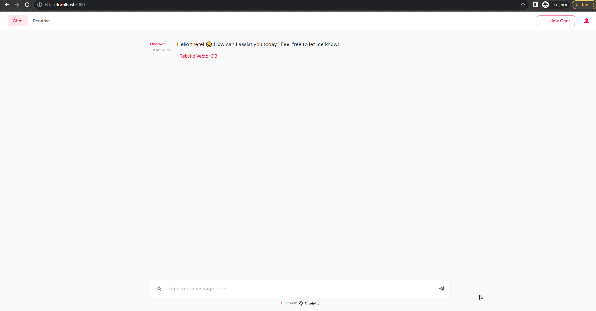

# PrivateDocBot 🚀🤖

[](https://www.linkedin.com/in/abhi5h3k/) [](https://stackoverflow.com/users/6870223/abhi?tab=profile)

## 🔐 Local LLM-Powered Chatbot for Secure Document Interactions




## Project Overview

Discover the innovation of this chatbot project, seamlessly merging [Chainlit](https://docs.chainlit.io/overview) user-friendly interface with localized language models 🌐. Tailored for sensitive data, it's a vital asset for both organizations and individuals. From deciphering intricate user guides to extracting vital insights from complex PDF reports, this project streamlines data access.

Equipped with advanced technology, it offers an engaging conversational experience. It redefines data interaction, empowering you with control.

## Use Cases:

- **Effortless Research**: Swiftly extract insights from intricate reports for informed decisions.
- **Enhanced Productivity**: Businesses streamline workflows by navigating user manuals seamlessly.
- **Precise Insights**: Extract vital data from complex financial reports efficiently.
- **Data Confidentiality**: Process sensitive data locally for utmost security.
- **Personalized Access**: Instantly retrieve essential information from a variety of PDF documents.
- **Engaging Learning**: Educational institutions offer interactive study material access.

### Prerequisites

Make sure you have the following installed:

- [Python 3.11.0](https://www.python.org/downloads/)
- pip 23.2.1
- To utilize the online database, you can simply comment out the line `database = "local"` in the `config.toml` file. This will ensure that the necessary dependencies are installed.
- Please note that for the local mode, a functional Node.js installation is essential as it relies on the Prisma CLI for its operation. You can find more details about setting up local persistence in the [Chainlit documentation](https://docs.chainlit.io/cloud/persistence/local).


## Setup Instructions
1. Clone the project repository using Git.
2. Download the necessary model from HuggingFace by visiting the following link: [Download Llama Model](https://huggingface.co/TheBloke/Llama-2-7B-Chat-GGML/blob/main/llama-2-7b-chat.ggmlv3.q8_0.bin). Once downloaded, move the model file to the "models" directory.
    - also tested with ```llama-2-7b-chat.ggmlv3.q2_K.bin``` 
    - [Models](models/models.md)
3.  Install the required Python packages by running the following command:
```pip install -r requirements.txt ```
4. Place your PDF document in the "data" directory. You can choose the appropriate document loader from the available options to match your requirements. Refer to [Document Loaders](https://python.langchain.com/docs/integrations/document_loaders/) for more information. Note that the current implementation is designed for PDF documents. 
 
5. Launch the application using the following command:
```chainlit run main.py -w```
6. For the initial setup, it's essential to build the vector database. Click on the "Rebuild vector" to initiate this process. 
 
7. With the setup complete, you can now ask pertinent questions related to your PDF document. Input your queries and receive informative responses.

#### Follow these instructions meticulously to ensure seamless functionality and accurate outcomes. Experience the convenience of easily querying your PDF office data for insightful insights!


## Welcome screen

To modify the welcome screen, edit the `chainlit.md` file at the root of your project. If you do not want a welcome screen, just leave this file empty.


## Log
```
pip install langchain[all]
pip install --upgrade langchain
pip install --upgrade python-box
pip install pypdf
pip install -U sentence-transformers
python -m pip install --upgrade pip
pip install ctransformers
pip install chainlit
```

## Note:
Inference speed will depend upon CPU cores and avaialble RAM. It's recomended to have multi core CPU (Laptop / PC) with atleast 16GB RAM. You can deploy it on Server for better performance.

Tested on : 
+ Windows 10
+ i7-10510U CPU @ 1.80GHz 
+ cores : 4
+ RAM : 16GB

## Future Scope:
+ Try adding memory
+ Increase performance by using https://www.ray.io/ or something similar
+ Upgrade to low latency Vector DB
+ Add caching
